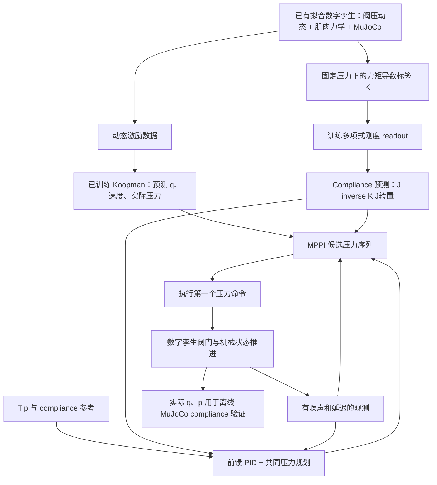

# Koopman、Compliance 多项式拟合与 MPPI：从数据到闭环控制

核对日期：2026-09-14。本文以外层仓库的代码、实际 checkpoint 元数据和已保存的 30 秒 xy 柔顺性实验为依据。

## 0. 阅读范围与版本

本次 compliance 工作继承了外层数字孪生和已训练的 Koopman checkpoint，并新增、训练了独立的 compliance readout。不能把继承的 Koopman 训练过程写成我们在本轮重新执行过的训练。

- Koopman：[`control/checkpoints/canarm_koopman.pt`](control/checkpoints/canarm_koopman.pt)。结构和训练记录已直接从文件核对。
- 初始静态 head：[`data/compliance_tangent_3000/head.npz`](data/compliance_tangent_3000/head.npz)。
- 扩展静态 head：[`data/compliance_tangent_wide_5000/head.npz`](data/compliance_tangent_wide_5000/head.npz)。
- 本文最终实验：[`deliverable/fig8_compliance_wide_slow_30s/README.md`](deliverable/fig8_compliance_wide_slow_30s/README.md)。
- 改动总览：[`PROJECT_PROGRESS_AND_RESULTS.md`](PROJECT_PROGRESS_AND_RESULTS.md)。

当前工作区另有后续增加的 `compliance_axes="xyz"`、`external_torque_nm` 接口和其他实验。这里详细解释的是已录制视频使用的 **xy、无外力补偿输入** 的控制链；不会把新接口当作旧视频已启用的功能。本文不修改这些后续代码。

原始 Koopman 采集目录 `control/data/campaign_20260911` 当前不在本地。96 条 episode 的数量、划分和指标由 checkpoint、训练报告、campaign summary 相互核对；没有在本次逐条重放原始数据或重训 Koopman。

## 1. 总体结构：三个不同层次的模型



| 层次 | 输入与输出 | 职责 |
| --- | --- | --- |
| 数字孪生 | 压力命令、当前物理状态 → 压力与机械运动 | 产生被控系统的仿真响应和训练标签 |
| Koopman 动力学 | 当前 48 维观测状态、24 维命令 → 下一时刻状态 | 预测阀压滞后、姿态和速度变化 |
| Compliance head | q、实际压力 → 刚度 → 末端柔顺性 | 快速评估候选状态的局部静态柔顺性 |

三者不是同一个网络。数字孪生的流量网络不等于 Koopman encoder；compliance 多项式也不是 Koopman 状态转移矩阵中的一部分。

## 2. 数字孪生提供了什么

主要入口是 [`digital_twin/twin_params.py`](digital_twin/twin_params.py)、[`digital_twin/sim_core.py`](digital_twin/sim_core.py)、[`digital_twin/actuator_model.py`](digital_twin/actuator_model.py)。

已有模型结合了学习到的阀压/流量行为，以及拟合参数控制的肌肉力学、阻尼和 MuJoCo 几何。肌肉力学中的力律包含：

$$
F_i(p_i,l_i)=\operatorname{clip}\{c_i p_i(b_i^2-3l_i^2),-4000,0\}.
$$

负号表示拉力。固定长度且未触发裁剪时，对压力是线性的；对长度含平方项，再加上腱长度、力臂随 q 的变化、松弛门控和裁剪，整体机械系统是非线性的。

这解释了为什么 q-p 多项式能在小姿态范围内较好近似刚度，但不能声称整个真实机械臂是线性系统。静态 compliance 标签冻结压力，因此不会直接把流量网络或阻尼的动态时间响应拟合进 C。

## 3. Koopman 的训练数据

来源：[`control/collect.py`](control/collect.py)、[`control/sim_env.py`](control/sim_env.py)、[`control/checkpoints/campaign_summary.json`](control/checkpoints/campaign_summary.json)。

### 3.1 数据规模

| 项目 | 已保存训练记录 |
| --- | ---: |
| Episode 数 | 96 |
| 每条时长 | 20 s |
| 每条转移数 | 3000 |
| 总转移数 | 288,000 |
| 总仿真时长 | 1920 s，即 32 分钟 |
| 控制采样率 | 150 Hz |
| 动捕采样率 | 240 Hz |
| MuJoCo 物理步长 | 1 ms |

每条 NPZ 中：`state` 为 `(3001,48)`，`action` 为 `(3000,24)`，另存 `truth` 和元数据。

**训练读取的是 `state`，不是 `truth`。** 因此 Koopman 学到的是包含观测噪声、延迟和速度估计影响的有限状态预测关系，而不是直接监督全部无噪声物理真值。

### 3.2 状态与动作的严格区分

$$
x_t=[q_t^{12},\widehat{\dot q}_t^{12},p_{t,\mathrm{measured}}^{24}]\in\mathbb R^{48},
\qquad u_t=p_{t,\mathrm{command}}^{24}\in\mathbb R^{24}.
$$

- q：弧度，按运动学关节顺序排列，不直接照搬 MuJoCo 声明顺序。
- 速度：因果估计值，单位 rad/s。
- p：滤波 ADC 得到的表压，单位 Pa。
- u：本次下发的目标表压，单位 Pa，并非当前实际腔体压力。
- 24 个压力通道按 CAN ID `0x101` 至 `0x118` 顺序；拮抗配对由 `pair_indices()` 给出，不能假设相邻通道配对。

状态中显式保存实际压力是必要的：相同命令 u，在不同当前压力 p 下会有不同充气/放气过程。

48 维状态未包含全部阀门内部积分、滤波、滞回等状态，也不包含外力。因此其 Markov 描述是近似的，不能承诺精确闭合。

### 3.3 观测模型

训练配置包含 0.10 度标准差的高斯关节噪声、两个动捕帧即约 8.33 ms 延迟，以及时间常数 0.04 s 的速度估计。

[`control/observation.py`](control/observation.py) 对每个新相机帧使用：

$$
\alpha=1-e^{-\Delta t/0.04},\qquad
\widehat{\dot q}\leftarrow\widehat{\dot q}+\alpha\left(\frac{q-q_{\rm prev}}{\Delta t}-\widehat{\dot q}\right).
$$

命令经过 ADC 量化和 150 Hz 同步边沿。压力观测来自滤波 ADC；离线环境没有完整模拟 CAN 回复的传输时延。上述传感器噪声、延迟是仿真假设，不是本轮重新标定的硬件参数。

### 3.4 八类激励，每类 12 条

| 类型 | 实现中的激励方式 |
| --- | --- |
| PRBS | 压差在负、零、正幅值间切换；更新判断使用 15/30/60/120 tick 的随机选择 |
| Chirp | 相位包含 `0.04*t + t*t/seconds` 的扫频正弦 |
| Multisine | 随机频率正弦与 2.7 倍频项，以 0.65/0.35 混合 |
| Common mode | 共同压力 `7+5*sin(2*pi*0.22*t)` psi，叠加差压激励 |
| Ringdown | 先激励，每 450 tick 周期中后段差压归零并降共同压力 |
| Joint reference | 通过前馈 PID 跟踪随机多关节参考 |
| Coupled | 0.3 Hz 基础项叠加 1.8 Hz 共同项，并变化共同压力 |
| Disturbance | 关节参考控制，同时施加 0.25 Hz 正半波四次方形状的扰动力，幅值 0.3–1.5 N |

随机基础压差幅值为 3–14 psi，基础频率随机范围 0.12–1.2 Hz；每步命令变化裁剪到每通道 +/-2 psi。若实际关节最大角度超过 0.65 rad，采集器降压到每通道 0.3 psi。

这只是采集保护逻辑，不保证角度从未短暂越过 0.65 rad；summary 中最小关节角达到约 -37.10 度。

采集中的前馈 PID 参数为 `kp=25, ki=8, kd=2, preview=0.035 s, allocation_mode=legacy_clip`，与后来视频运行时的 `kd=5, preview=0.07 s, bounded` 不同。

### 3.5 Domain randomization

`index % 4 != 0` 的 episode 使用随机化，即该 96 条编号范围内约 75% 的 episode：

- 连杆质量、支架质量、关节刚度乘以 0.90–1.10。
- 关节阻尼、腱阻尼乘以 0.8–1.2。
- 执行器 fill gain、vent gain、force coefficient 乘以 0.85–1.15。
- 每个通道加入 0–150 Pa/s 的额外泄漏。

这是设定的鲁棒性训练场景，不是测量所得置信区间。不同物理参数和未观测外力未作为独立模型输入，模型必须在有限状态中近似这些变化。

### 3.6 防止相邻样本泄漏的划分

按激励 family 分组，每组先用固定种子打乱完整 episode，再分为训练 8、验证 2、测试 2 条。

总计：训练 64 条/192,000 转移；验证 16 条/48,000 转移；测试 16 条/48,000 转移。训练窗口只在同一 episode 内抽取，不跨轨迹边界，也不是随机拆散相邻 150 Hz 帧。

## 4. Koopman 网络结构：哪些是线性，哪些不是

来源：[`control/koopman.py`](control/koopman.py) 中 `LiftedDynamics`。

### 4.1 状态标准化

$$
\bar x=(x-\mu_x)\oslash s_x,\qquad \bar u=u/206842.71.
$$

输入归一化压力常数为 30 psi = 206842.71 Pa。状态均值和标准差仅从训练集计算，标准差下限分别为 q 的 0.03 rad、速度的 0.15 rad/s、压力的 5000 Pa。

这些操作是仿射映射。当前 checkpoint 实际标准差大约为 q 的 0.090–0.145 rad、速度的 0.329–0.499 rad/s、压力的 21.4–24.2 kPa。

### 4.2 学习 observables 的 encoder

$$
h_1=\tanh(W_1\bar x+b_1),\qquad
\phi_\theta(\bar x)=\tanh(W_2h_1+b_2),
$$

其中维度为 `48 → 96 → 48`。两个 Linear 层各自是仿射运算，两个 Tanh 是非线性运算。学习特征不限于 q，也能依赖速度和压力。

提升状态为：

$$z=[\bar x;\phi_\theta(\bar x)]\in\mathbb R^{96}.$$

前 48 维保留标准化物理状态，后 48 维是学习特征。96 并不是隐藏层宽度与输出的再次相加；隐藏层宽度也恰好是 96，但属于另一个概念。

### 4.3 状态推进包含双线性项

为了与代码完全对应，使用行向量形式：

$$
z_{t+1}=z_t A^T+\bar u_t B^T+b+
\operatorname{vec}_{j,r}\{\bar u_{t,j}(z_tV)_r\}\,W.
$$

| 参数 | 形状 | 作用 |
| --- | --- | --- |
| A | 96 × 96 | 提升状态线性推进 |
| B | 96 × 24 | 输入线性作用 |
| b | 96 | 常数偏置 |
| V | 96 × 8 | 将提升状态投影到 8 个交互方向 |
| W | 192 × 96 | 将 24×8 个输入-状态交互项映射回提升状态 |

双线性项的分量是：

$$[g(z,u)]_\ell=\sum_{j=1}^{24}\sum_{r=1}^{8}\bar u_j\left(\sum_{i=1}^{96}z_iV_{ir}\right)W_{(j,r),\ell}.$$

- `z @ A.T`：对 z 线性。
- `u @ B.T`：对 u 线性。
- `zV`：对 z 线性。
- `u_j*(zV)_r`：对联合变量 `(z,u)` 是双线性，而非线性。
- 固定 u 后，对 z 是仿射；固定 z 后，对 u 是仿射；两者同时变化时不是联合线性系统。
- 从原始 x 到下一原始状态，还经过 Tanh encoder，所以整体不是线性预测器。

它可以理解为由输入改变状态转移矩阵的低秩双线性受控提升模型。不能仅写 `z_next=A z+B u` 而漏掉交互项。checkpoint 的 W 非零，核对范数约 0.364，不是一个被关闭的占位项。

### 4.4 Decoder 不使用神经网络

$$\widehat x=z_{1:48}\odot s_x+\mu_x.$$

只取前 48 维，再反标准化；这是仿射 decoder。不存在另一个非线性重建网络。初始 encode 后立即 decode 可以恢复输入，属于结构上保证，不需要单独重建损失。

模型共 40,176 个可训练标量，不包含 96 个均值/尺度 buffer。提升维度有限，没有证明存在精确 Koopman 不变子空间，也没有证明该模型全局稳定。

## 5. Koopman 如何训练

来源：[`control/train.py`](control/train.py)。

### 5.1 岭回归初始化，再端到端梯度训练

encoder 首先随机初始化。训练样本拼接后隔一个转移抽样，计算 z、下一帧 encode 和归一化 u。设计矩阵为：

$$D=[Z,\bar U,\mathbf1],\qquad T=Z_{\rm next}-Z.$$

求解：

$$\Theta=(D^TD+0.5I)^{-1}D^TT.$$

据此设 `A=I+Theta_z.T`、`B=Theta_u.T`、`b=Theta_const`。初始化回归对系数是线性问题；此时 V 随机、W 为零，双线性项尚未产生作用。

之后 AdamW 同时优化 encoder、A、B、b、V、W。联合训练含 Tanh 和参数乘积，不是一次线性最小二乘即可完成。

### 5.2 30 步开环 rollout 训练

每个 batch 随机选 episode 和起点，抽取 31 帧状态及 30 个动作。只对起始状态 encode，然后连续调用 step 30 次。

中间没有用真实状态覆盖预测，没有每步重新 encode 真实状态，也没有 teacher forcing 的状态重置。真实动作序列作为已知输入驱动 rollout。

训练预测时域：`30/150=0.2 s`。这与实际 MPPI 的 16 步预测时域不同。

### 5.3 训练损失

令 `a_j=3` 对应 q，`a_j=0.15` 对应速度，`a_j=0.4` 对应压力。对 batch 中一个窗口，状态项为：

$$
L_{\rm state}=\frac1H\sum_{h=1}^{H}\frac1{48}
\sum_{j=1}^{48}a_j\left(\widehat z_{h,j}-\bar x_{h,j}\right)^2,\qquad H=30.
$$

在第 1、5、15、30 步添加学习特征一致性项：

$$
L_{\rm lift}=\frac{0.02}{H}\sum_{h\in\{1,5,15,30\}}
\frac1{48}\left\|\widehat z_{h,49:96}-\operatorname{stopgrad}(\phi_\theta(\bar x_h))\right\|_2^2.
$$

最终在 batch 上取均值。`detach/stopgrad` 使目标端的 encoder 输出不沿该分支反传，但预测端的初始 encoder 与推进网络仍可训练。

可选 warm-start anchor 项：

$$L_{\rm anchor}=\lambda_a\sum_{\theta_i}\operatorname{mean}[(\theta_i-\theta_{i,\rm start})^2].$$

当前 checkpoint 的 `anchor_strength=0`、`warm_start=null`、`freeze_encoder=false`，因此没有用该项。AdamW 的 weight decay 是优化器中的衰减机制，不应与上面的显式训练损失混为一谈。

### 5.4 实际保存的训练参数

| 参数 | 当前 checkpoint 记录 |
| --- | --- |
| epochs | 80 |
| 最佳模型轮次 | 60 |
| 每轮 optimizer steps | 40 |
| batch size | 512 个窗口 |
| 训练 horizon | 30 |
| 优化器 | AdamW |
| 起始 learning rate | 2e-4 |
| 最小 learning rate | 2e-5 |
| 调度 | CosineAnnealingLR，T_max=80 |
| weight decay | 1e-5，由训练代码核对 |
| 梯度范数裁剪 | 1.0 |
| 随机种子 | 20260911 |
| 训练精度 | float32 CUDA，允许 TF32；ridge 初始化用 float64 |
| 记录的训练设备 | NVIDIA GeForce RTX 5090 |
| 记录的 PyTorch | 2.13.0+cu130 |
| 记录的训练耗时 | 约 84.16 s，不含采集 |

总共 3200 次梯度更新，抽取约 1,638,400 个窗口；这些是可重复抽到、相互重叠的窗口，不能当作同样多的独立新轨迹。

### 5.5 选择最佳 checkpoint

每轮评估验证集 30 步误差，用：

$$S_{\rm val}=\mathrm{RMSE}_{q,30}[\mathrm{degree}]+2\times10^{-5}\mathrm{RMSE}_{p,30}[\mathrm{Pa}].$$

这是模型选择分数，不是训练反传损失。选择第 60 轮后，再做更完整的验证/测试。训练时每轮的窗口采样密度与最后报告不同，因此第 60 轮历史数值与最终 validation 表可能略有差异。

### 5.6 测试集开环误差

来源：[`control/checkpoints/canarm_koopman.json`](control/checkpoints/canarm_koopman.json)，与 `.pt` 元数据一致。

| 时域 | 时间 | Koopman q RMSE | 保持初始状态基线 q RMSE | Koopman 压力 RMSE |
| --- | ---: | ---: | ---: | ---: |
| 1 步 | 6.67 ms | 0.1614° | 0.2274° | 310.4 Pa |
| 5 步 | 33.33 ms | 0.2588° | 0.8543° | 1080.5 Pa |
| 16 步 | 106.67 ms | 0.5809° | 2.6140° | 2510.9 Pa |
| 30 步 | 200 ms | 0.8720° | 4.5620° | 3345.6 Pa |
| 75 步 | 500 ms | 2.3384° | 8.2216° | 5520.0 Pa |

这说明模型优于该 persistence 基线，但也有随时域增长的误差。不能用静态 compliance head 的高精度替代 Koopman 动力学预测精度。

### 5.7 真实数据微调接口

训练脚本支持 `--warm-start`、`--freeze-encoder` 和 `--anchor-strength`。warm start 保留原 scaler，默认学习率降为 2e-5。当前 checkpoint 没有执行此类真实数据微调，也没有在本次重新采集真实机械臂转移。

## 6. Compliance 从旧拟合到最终拟合

### 6.1 第一版：直接拟合有限时间受力响应

[`digital_twin/train_compliance_head.py`](digital_twin/train_compliance_head.py) 最初以随机 q、p 为初态，对三个方向施加 +/-0.1 N，等待指定时间后计算：

$$C_{:,j}\approx\frac{x_{\rm tip}(+F_j,T)-x_{\rm tip}(-F_j,T)}{2F}.$$

其中一次主要训练用 `T=0.25 s`、3000 点。直接拟合对称 C 的六个分量，特征包含 q、q 的平方、p、p 的平方、pair mean、pair difference、逆 pair mean 和局部交叉项，约 133 维，ridge=0.001，并标准化特征与目标。

由于含 `1/clip(mean_pressure)`，它严格说是包含有理特征的线性读出，不是纯多项式。该版 600 点 holdout 相对误差中位数约 7.44%，p90 约 15.70%。

问题：等待固定时间不等于收敛到静态平衡；测量点是 50 mm 杆尖，而控制点是板中心；不同 q、p 下的瞬态可能被误认为局部柔顺性。该实现和数据已标记 legacy，后续视频不使用它作静态真值。

### 6.2 最终定义：局部固定压力静态 tangent

[`digital_twin/tangent_compliance.py`](digital_twin/tangent_compliance.py) 先定义无外加力时的剩余广义力矩：

$$\tau_{\rm net}(q,p)=\tau_{\rm passive}(q)+\tau_{\rm actuator}(q,p)-\tau_{\rm bias}(q,\dot q=0).$$

在零速度时，bias 主要包含重力项；肌肉力由当前 q 对应腱长与固定 p 给出。每次评估 reset MuJoCo data，设置 q，计算肌肉力和 forward dynamics。

关节刚度用中心差分：

$$K_{:,j}=-\frac{\tau_{\rm net}(q+\epsilon e_j,p)-\tau_{\rm net}(q-\epsilon e_j,p)}{2\epsilon},\quad\epsilon=10^{-5}\ \mathrm{rad}.$$

然后执行 `K=(K+K.T)/2`。每个样本需 12×2 次力矩评估，得到完整 12×12 刚度矩阵。

板中心 Jacobian 为 `J∈R^(3×12)`，由 MuJoCo 或已验证一致的解析运动学得到。微扰平衡满足 `K delta_q=J.T delta_F`，因此：

$$C(q,p)=J(q)K(q,p)^{-1}J(q)^T.$$

在当前状态不是静态平衡时，这一定义相当于加入恒定保持力矩抵消原剩余力矩，再计算小扰动切线。它不是把完整 PID/MPPI 闭环对外力的响应也算进去。

阻尼不产生这份零速度静态 C。压力保持不变，而实际碰撞时压力、速度及控制命令都可能变化，故需另做动态验证。

### 6.3 为什么改为拟合 K，而不是直接拟合 C

对输入的依赖常常在 K 中更容易表示。将对称结构保留在 K 中，并通过运动学与矩阵求解映射到末端，能够自然表达不同姿态的几何作用。

但当前拟合没有用 Cholesky 等参数化强制保证所有域外 K 都正定。保持对称不等于全局正定。独立真值 evaluator 会检查正定性，训练报告也检查了采样点；runtime head 本身不会自动修复不定矩阵。

### 6.4 最终 polynomial 特征恰好为 403 维

令 `s=p/6894.757`，即 psi 单位压力：

$$\psi(q,p)=[1,\ q_i,\ q_iq_j\ (i\le j),\ s_a,\ q_i s_a].$$

| 特征块 | 数量 |
| --- | ---: |
| 常数 | 1 |
| q 的一次项 | 12 |
| q 的上三角二次项，含平方和交叉项 | 78 |
| 24 通道压力一次项 | 24 |
| 12×24 的 q-pressure 交叉项 | 288 |
| 总计 | 403 |

最终特征中 **没有 p² 项，没有逆压力项，没有速度输入**。这是二次总次数的状态-压力特征映射。固定 q 时，预测 K 对 p 是仿射；固定 p 时，对 q 至多二次。

输出是 K 的 78 个上三角元素。学习系数矩阵为 `Theta∈R^(403×78)`，共 31,434 个系数，再加特征均值和尺度。

### 6.5 标准化与闭式拟合

只用训练子集计算特征 mean/std，常数列设 mean=0、std=1，过小 std 替换为 1。K 标签没有像旧 head 那样再次做 y 标准化。

$$\widetilde\Psi=(\Psi-\mu_\psi)\oslash s_\psi,$$

$$\Theta=(\widetilde\Psi_{\rm tr}^T\widetilde\Psi_{\rm tr}+10^{-5}I)^{-1}\widetilde\Psi_{\rm tr}^TY_{\rm tr}.$$

这是 ridge 闭式线性回归，无神经网络反传、epoch 或 rollout loss。当前 I 正则也作用于常数列。

运行时：

$$\widehat K=\operatorname{symUnpack}(\widetilde\psi\Theta),\qquad \widehat C=J\operatorname{solve}(\widehat K,J^T).$$

虽然系数拟合是线性的，输入特征含乘积；最终还含三角运动学和矩阵求逆。所以 **最终 C 并不是 q、p 的普通二次多项式，更不是线性输出系统**。

### 6.6 两轮最终静态训练

随机种子为 20260913；q 各维均匀采样于 +/-0.1 rad。独立随机样本的前 80% 用于训练，后 20% 用于 holdout；这与动态 episode 的分层划分不同。

| 项目 | 3000 点静态 head | 5000 点扩展静态 head |
| --- | ---: | ---: |
| 训练/holdout | 2400/600 | 4000/1000 |
| pair mean 范围 | 2–14 psi | 0.3–14.5 psi |
| pair difference 抽样 | +/-3 psi | +/-3 psi，必要时裁剪避免负压力 |
| ridge | 1e-5 | 1e-5 |
| holdout median 相对误差 | 0.0488% | 0.0701% |
| holdout p90 | 0.1024% | 0.1858% |
| holdout max | 0.2856% | 0.8875% |

holdout 指标由 `||C_hat-C||F / ||C||F` 计算，是三维 C 的拟合误差，不等于闭环的 xy 目标跟踪误差。抽样角度较小且训练和评价共享同一个 nominal twin，是拟合误差很低的重要条件。

## 7. 在线控制的前两步：前馈 PID 与共同压力优化

### 7.1 位置控制 prior

[`control/controller.py`](control/controller.py) 的前馈使用 70 ms preview：

$$q_{\rm ahead}=q_r+0.07\dot q_r+\tfrac12(0.07)^2\ddot q_r,\quad
\dot q_{\rm ahead}=\dot q_r+0.07\ddot q_r.$$

在独立拟合 MuJoCo 模型里计算 inverse dynamics 所需力矩，构造固定姿态下的压力到力矩映射 `G∈R^(12×24)`，单位 N·m/psi，并执行有界压力分配。

PID 压差反馈为：

$$d_{\rm fb}=k_p(q_r-q)+k_i I+k_d(\dot q_r-\widehat{\dot q}),\quad I\leftarrow\operatorname{clip}(I+\Delta t(q_r-q),-0.3,0.3).$$

视频默认 `kp=25, ki=8, kd=5`，在内部乘 `6894.757` 换为 Pa 对应增益。将 `+d_fb/2` 和 `-d_fb/2` 加到各对通道，并使用 back-calculation 抗积分饱和。

这个 G 在源码里也叫 `B` 或 `last_B`，但它是物理压力-力矩映射，**与 Koopman 的 96×24 的 B 完全不同**。本文统一称它 G。

### 7.2 保力矩的共同压力参数化

令 M 将 12 个 pair mean 同时加到每对两通道；D 将差压的正负一半映射到对应通道。压力用 psi 表示：

$$p=M m+D d.$$

以 PID prior 压力 `p_prior` 对应的力矩 `tau_prior=G p_prior` 为目标，令 `Q=(GD)^+`：

$$o=DQ\tau_{\rm prior},\qquad N=M-DQGM,\qquad p(m)=o+Nm.$$

理想满秩且没有后续压力投影时，`G p(m)=tau_prior`。秩缺失或裁剪会破坏精确保力矩，因此这不是无条件解耦保证。

### 7.3 外层 planner 本身也有一个优化代价

每 15 个 150 Hz tick 优化一次，即 nominal 10 Hz，使用训练 head：

$$r(m)=\begin{bmatrix}
\operatorname{vec}(\widehat C_{xy}(q_r,p(m))-C_{r,xy})/0.01\\
0.001(m-8)\\
\min(p(m),0)\\
\max(p(m)-30,0)
\end{bmatrix},\qquad \min_m\tfrac12\|r(m)\|^2.
$$

- 用当前 `q_ref` 和第一个未来 compliance target；不是再做一个全长动力学 rollout。
- `scipy.optimize.least_squares` 默认 TRF 方法，有限差分 Jacobian，`max_nfev=15`，`ftol=xtol=gtol=1e-6`。
- m bounds 从 head 元数据读取，扩展模型为 0.3–14.5 psi。
- 正则中的 `0.001` 是残差系数，平方后对应 1e-6；不能写成平方误差权重 0.001。
- 压力软约束是单通道的负值/超过30 psi惩罚；最后 `project_pressures` 另行执行 pair-sum 硬限制。
- 每个控制 tick 将 m 向优化结果移动，变化上限为 `5*dt` psi，即 0.03333 psi/tick。

该 slew limit 只直接约束 planner 的共同压力，不是最终所有 MPPI 命令的严格全通道变化上限。

## 8. MPPI 如何产生候选序列

### 8.1 已录制最终实验的实际参数

| 参数 | 大幅变化最终视频 |
| --- | --- |
| dt | 1/150 s |
| Horizon H | 16 步，即约 106.67 ms |
| 候选数 N | 32，包含两个特殊候选 |
| 每 tick rollout 次数 | 32×16=512 个候选状态推进 |
| 压差噪声标准差 | 0.03 psi |
| 共同压力噪声标准差 | 0.03 psi |
| 差压时间 knots | 4 个，线性插值到 16 步 |
| 共同压力噪声时间形状 | 一次采样，在 horizon 内保持不变 |
| 旧差压修正衰减 | 0.75 |
| `tip_weight` | 10 |
| `compliance_weight` | 10 |
| `action_regularization` | 10 |
| `temperature_min` | 0.0001 |
| `adapt` | true |
| `preview_actions` | false |
| `tangent_compliance` | true |
| 控制 compliance block | xy，包含 Cxx、Cyy、Cxy、Cyx |
| 控制随机种子 | 20260912 |
| 推理 | NumPy float64，BLAS 限制为 1 线程 |

类默认是 64 samples、0.5 psi noise、0.1 action regularization，不能把这些默认值误写成视频的实际设置。视频入口通过 kwargs 覆盖了它们。

### 8.2 Warm start 和噪声

把上一周期的 `correction[H,12]` 向前移一格，尾部重复末端值。对每个候选、4 个时间 knot、12 个 pair 采样高斯噪声，在 knots 之间线性插值：

$$\delta^{(i)}_h=0.75\delta^{\rm shifted}_h+\epsilon^{(i)}_h.$$

随后覆盖两个候选：候选 0 的 delta 为零，即纯 prior；候选 1 直接用 shifted correction，不乘 0.75。它们的共同压力随机修正也设为零。

其他候选还各采样一个 12 维共同压力修正 `eta_i`，在所有 H 步重复。

### 8.3 24 通道压力序列与投影

因为 `preview_actions=false`，本轮算出的 prior 在 H 步中重复。对每个 pair：

$$u^{(i)}_{h,a}=u_{{\rm prior},a}+\delta^{(i)}_{h,j}/2+\eta^{(i)}_j,$$
$$u^{(i)}_{h,b}=u_{{\rm prior},b}-\delta^{(i)}_{h,j}/2+\eta^{(i)}_j.$$

随后 `project_pressures` 保证命令非负、单通道不超过 30 psi、每个测量拮抗 pair 的和不超过 30 psi。它是分段的非线性约束操作。

70 ms 的前馈 preview 仍然存在。`preview_actions=false` 只表示没有额外沿 horizon 更新 prior，不能理解为没有任何预瞄。

## 9. Koopman rollout 与 innovation 修正

每个控制周期，把实际可用观测拼成 x，encode 一次并复制给 N 个候选。之后每步只做提升状态推进与仿射 decode，不重复调用 Tanh encoder 来重新投影预测状态。

可选自适应不是在线重训网络，而是维护一个 48 维残差均值：

$$\nu_t=0.96\nu_{t-1}+0.04\operatorname{clip}(x_t-\widehat x_{t|t-1},-b,b),$$

其中 q、速度、压力分量的裁剪界分别为 0.002 rad、0.04 rad/s、1000 Pa。下一次 rollout 每步在 z 前 48 维加 `nu/xscale`；后 48 维不直接加此偏置。

最后保存的单步 `self.predicted` 是模型 encode/step/decode 的预测，源码没有在此保存步骤另加 innovation。准确描述这个细节比笼统写“在线辨识了模型”更合适。

解码后的每步状态：

$$\widehat q_h=\widehat x_{h,1:12},\quad
\widehat v_h=\widehat x_{h,13:24},\quad
\widehat p_h=\widehat x_{h,25:48}.$$

用解析 FK 得到 `tip_hat=f(q_hat)`，用多项式 head 得到 `C_hat=C_hat(q_hat,p_hat)`。训练 head 不负责预测压力到达多快；这部分由 Koopman 完成。

命令做了压力投影，但 rollout 的预测状态没有额外硬裁剪到物理范围。有限字典、多步误差和域外 head 预测仍可能影响候选评分。

## 10. MPPI 的完整 cost function

下式对应实际代码，不省略那些权重较小但确实存在的项。设 `i=1...N` 为候选、`h=1...H`，`beta_h=2` 当 h=H，其余为 1。

### 10.1 每步关节项

$$
L_{qv}^{(i,h)}=\beta_h\left[
\frac1{12}\sum_j\left(\frac{\widehat q_{h,j}^{(i)}-q_{r,h,j}}{0.08}\right)^2
+0.015\frac1{12}\sum_j(\widehat v_{h,j}^{(i)}-\dot q_{r,t,j})^2\right].
$$

注意速度参考是本轮当前 `qd_ref`，沿 horizon 没有取不同的未来参考速度。末端加倍只作用于这个关节位置/速度括号。

### 10.2 Tip 项

$$L_x^{(i,h)}=w_x\sum_{a\in\{x,y,z\}}\left(\frac{f_a(\widehat q_h^{(i)})-x_{r,h,a}}{0.010}\right)^2,\quad w_x=10.$$

这是三维位置误差，哪怕 compliance 只控制 xy。归一化尺度是 10 mm，使用 sum，不是三个方向的 mean。

### 10.3 Compliance 项

$$L_C^{(i,h)}=w_C\frac{\|\widehat C_{xy}(\widehat q_h^{(i)},\widehat p_h^{(i)})-C_{r,h,xy}\|_F^2}{\max(\|C_{r,h,xy}\|_F,10^{-12})^2},\quad w_C=10.$$

这是 **相对误差的平方**，不是相对误差，也不是只比较两个特征值。完整 2×2 block 参与，非对角耦合 Cxy 和 Cyx 也被惩罚。

未来参考 `future_q/future_tip/future_compliance` 均取 `t+(h)*dt`；不足 horizon 时最后一个参考重复补齐。

### 10.4 序列正则与首步压力项

以 Pa 表示 delta、eta、u、p，定义 `P5=5*6894.757 Pa`：

$$R_{\delta}^{(i)}=10\operatorname{mean}_{h,j}(\delta_{h,j}^{(i)}/P5)^2,$$
$$R_{\eta}^{(i)}=10\operatorname{mean}_{h,j}(\eta_{h,j}^{(i)}/P5)^2,$$
$$R_{p}^{(i)}=0.004\operatorname{mean}_{a=1}^{24}\left[(u_{1,a}^{(i)}-p_{t,\mathrm{measured},a})/P5\right]^2.$$

`R_p` 比较的是首步命令和当前测得压力，并非首步与上一步命令之差。`R_delta` 和 `R_eta` 使用投影前的修正参数；压力投影可能改变其实际执行效果。

### 10.5 总分

$$S_i=\frac1H\sum_{h=1}^{H}\big(L_{qv}^{(i,h)}+L_x^{(i,h)}+L_C^{(i,h)}\big)+R_\delta^{(i)}+R_\eta^{(i)}+R_p^{(i)}.$$

没有独立碰撞/接触力代价，没有 MPPI 显式加速度跟踪项，没有约束最终状态的终端集合。压力硬约束通过投影实现，而不是一个线性 MPC 的 QP 约束矩阵。

因此这是包含非线性 FK、矩阵求解、多项式读出和双线性预测的非线性候选评分问题，即使 A、B 中有线性块，也不是线性二次型 MPC。

## 11. MPPI 如何从评分得到命令

将 NaN 或正负无穷分数替换为 1e12。然后设置温度：

$$\lambda=\max(10^{-4},0.25\operatorname{std}(S_1,...,S_N)),$$

$$\widetilde w_i=\exp\left[\operatorname{clip}\left(-\frac{S_i-\min_jS_j}{\lambda},-60,0\right)\right],\quad
w_i=\widetilde w_i/\sum_j\widetilde w_j.$$

低 cost 的候选权重较大。低温度接近选最优样本，高温度让更多样本参与平均。温度每 tick 根据当前候选分数变化，不是固定常数。

保存差压 warm start：`correction = sum_i w_i * delta_i`。执行命令：

$$u_t=\operatorname{project}\left(\sum_iw_i u^{(i)}_1\right).$$

只执行第一步，下一周期拿新观测重新规划。共同压力随机修正没有保存成独立的 horizon warm start；planner 的 mean/goal 则保留。

每个控制 tick 只有一轮采样评分和加权，不存在额外的几十轮 MPPI 内循环。输出权重不做反向传播，也不在线更新 Koopman/head 的系数。

这是工程化的 MPPI-style 加权采样控制器。代码没有显式实现经典 path-integral 推导中完整的采样分布似然比/控制-噪声交叉校正项，也没有协方差自适应；不应把未实现的理论项加进论文公式。

## 12. 一轮控制的伪代码

```text
read noisy/delayed q, estimated qdot, measured pressure
sample current and future tip/joint/compliance references
prior = fitted_inverse_dynamics_preview + PID_pressure_difference
if planner update tick:
    optimize 12 pair means using trained polynomial compliance readout
slew means; recompute differences to preserve prior torque
build N pressure sequences around prior; project pressure commands
encode observation once and duplicate the lifted state N times
update bounded innovation from previous one-step prediction
for h = 1 ... H:
    advance each lifted state with A, B, bias, and low-rank bilinear term
    add normalized innovation to physical state coordinates
    decode q, velocity, actual pressure
    compute nonlinear tip FK and polynomial-stiffness compliance readout
    accumulate joint, velocity, tip and relative compliance costs
add correction penalties and first-action/measured-pressure penalty
compute adaptive-temperature exponential weights
save weighted difference sequence; apply weighted first action
advance valves and MuJoCo, obtain next observation, repeat
after the run: calculate C_true independently from recorded true q and p
```

## 13. 任务参考与视频中的实际控制效果

xy 路径为 `x=0.035*sin(phi)`、`y=0.018*sin(2*phi)` 米，叠加在起始板中心；z 使用可达 dome。关节参考由有界 IK 生成后用三次样条得到 q、速度、加速度。

柔顺性参考：

$$b(t)=\tfrac12+\tfrac12\sin\phi_C(t),$$
$$C_{xx,r}=C_{\rm hard}+(C_{\rm soft}-C_{\rm hard})b(t),$$
$$C_{yy,r}=C_{\rm soft}-(C_{\rm soft}-C_{\rm hard})b(t).$$

大幅实验设 `C_hard=0.054`、`C_soft=0.098 m/N`，两个方向相反变化，Cxx+Cyy=0.152 m/N。相位由平滑后的轨迹相位缩放，nominal compliance period=18 s，而 tip period=9 s；包含启停 ramp，因此不是整个视频内匀速相位。

目标最大轴比 `0.098/0.054≈1.815`。真实蓝色椭圆由实际 q 和 p 的 MuJoCo K 独立计算，再以 `tip_xy+0.2*Cxy*[cos(theta),sin(theta)]` 绘制。目标和实际同中心、同物理尺度，无长宽方向不等比例拉伸。

| 实验 | Tip RMS | True xy compliance median error | p90 |
| --- | ---: | ---: | ---: |
| 小幅目标 0.060–0.078 | 1.071 mm | 0.925% | 1.417% |
| 大幅目标，nominal 9 s compliance period | 1.359 mm | 8.651% | 15.110% |
| 大幅目标，nominal 18 s compliance period | 1.527 mm | 3.143% | 4.326% |

最终实际长宽比约 1.681，明显小于目标 1.815。Cxx/Cyy 与参考的相关系数约 0.9903/0.9893，最大 pair 命令和约 29.224 psi。

小幅实验的共同压力控制消融：关闭时 true xy compliance median error 约 9.151%，开启后约 0.951%。这支持共同压力控制的必要性，但不等于隔离证明了 Koopman MPPI 相对于 planner+PID 的独立收益；该更细的消融尚不能由这些记录推出。

## 14. 可以确认的事实与尚未验证的部分

1. 确实由学习到的 head 参与共同压力规划和每步 MPPI cost；它不是仅用于绘图。
2. 真值绘图不把 target 或 head 预测复制成 C_true，但标签生成和真值评价共享 nominal twin。
3. 整体是 fitted-physics feedforward + PID + nonlinear compliance planning + bilinear learned-model MPPI，而非纯 Koopman 控制。
4. 模型推进只使用 24 维压力命令；新增 external_torque 接口目前只影响前馈分配，未把力输入加入这个 checkpoint 的 B。
5. 当前 head 对稱但没有全域 SPD 保证；域外、不稳定或不合理预测状态需要额外处理。
6. Koopman campaign 最大记录 pair 命令和约 24 psi；最终大幅实验接近 29.224 psi。因此尽管合法上限是 30 psi，最终部分命令仍超出已记录的动态训练覆盖，这是一项外推风险。
7. 静态 head 训练把 pair difference 限在 +/-3 psi，但 MPC 不对所有候选强制同样的域限制；训练精度不能保证所有候选域外精度。
8. 控制器没有直接观测硬件真实 C 的闭环误差，未完成真实硬件的动态柔顺性、碰撞和力反馈验证。
9. 最终求解耗时 median 约 16.26 ms、p99 约 89.35 ms，高于 150 Hz 的 6.67 ms；当前是按仿真时钟运行的离线验证。
10. 没有新执行 PPO/RL 训练；“MPPI control cost”和“Koopman supervised training loss”也不应统称为 reward。

## 15. 复现入口与核对依据

原始动态数据缺失时，以下采集命令重建同类 96 条 campaign；不是保证逐字节复现原数据或原权重。保留原 checkpoint，使用独立输出目录进行新训练。

```powershell
.\.venv\Scripts\python.exe -m control.collect --out control/data/campaign_rebuild --episodes 84 --seconds 20 --workers 8
.\.venv\Scripts\python.exe -m control.collect --out control/data/campaign_rebuild --start 84 --episodes 12 --family disturbance --seconds 20 --workers 8
.\.venv\Scripts\python.exe -m control.train --data control/data/campaign_rebuild --out control/checkpoints/rebuilt_koopman.pt --epochs 80 --steps 40 --batch 512 --horizon 30 --device cuda
.\.venv\Scripts\python.exe -m digital_twin.train_tangent_compliance --samples 5000 --mean-min-psi 0.3 --mean-max-psi 14.5 --out data/compliance_tangent_wide_rebuild
.\.venv\Scripts\python.exe -m control.render_fig8_compliance_gif --duration-s 30 --fps 10 --compliance-soft 0.098 --compliance-hard 0.054 --compliance-period-s 18 --compliance-head data/compliance_tangent_wide_5000/head.npz --out-dir deliverable/fig8_compliance_documented_replay --mp4
```

最后一条使用原已训练、已验证的两个模型，不会自动选择上面新训练的 rebuilt 权重。

本次文档核对还用随机状态对 PyTorch 和 NumPy 的单步实现做了数值比较，归一化最大差约 9.3e-7，符合 float32/float64 路径的数值差异。没有为写文档重跑完整训练或视频实验。

记录的当前文件 SHA-256：

```text
control/checkpoints/canarm_koopman.pt
c5bb37abf3dc09a27051aef145b911fe6c2173dd50e0de4cafa0868cdb073606

data/compliance_tangent_wide_5000/head.npz
151e7389041be181f09352ea7667984c9969830bfa9984fda793c0f94a010368
```

以上训练事实由 checkpoint 元数据、[`control/train.py`](control/train.py)、[`control/collect.py`](control/collect.py) 和保存的报告共同支撑；公式由当前源码逐项展开。应保留这些版本信息，避免把后来修改的模型参数或实验结果混入同一份解释。
