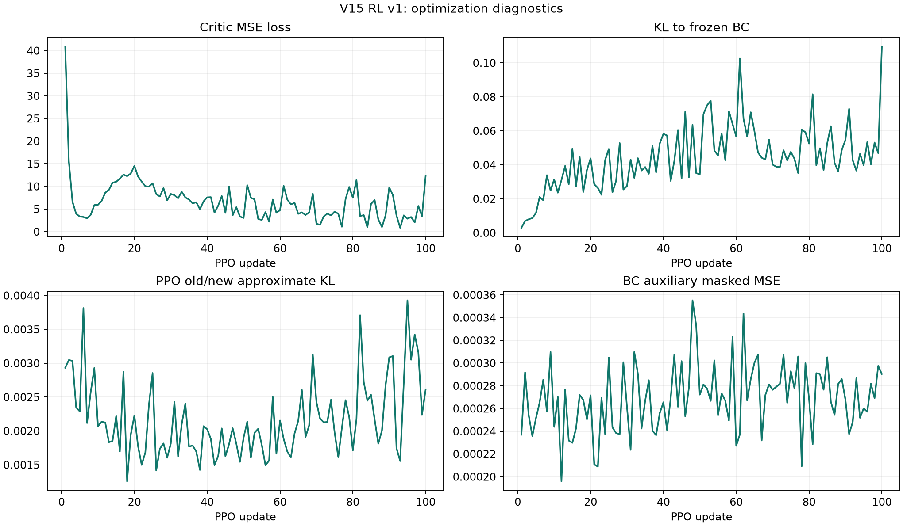
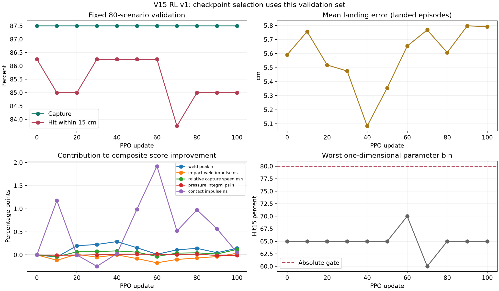

# V15 残差 RL 第一轮完整分析

日期：2026-09-18。

本报告分析 `teacher_runs/v15_improved/rl_v1_formal`。原训练、奖励、环境及 checkpoint 均保持原样；新增分析脚本只读取已有结果，写入分析产物。数值证据与机制推测在下文分别说明。

## 1. 训练完整性与本轮定位

| 项目 | 实际结果 |
|---|---:|
| 已完成 PPO updates | 100/100 |
| 新训练回合 | 800，无重复 seed |
| 全部决策步 | 349,142 |
| 有效动作决策步 | 340,911 |
| 单次运行耗时 | 3,530.63 s，58.84 min |
| 固定选模验证集 | 80场景，BC基线加10次RL验证 |
| 最佳 checkpoint | 第60次更新 |
| 最新 checkpoint | 第100次更新 |
| 因 PPO KL 提前结束优化的 updates | 6、13、90、95 |
| 非有限损失或缺失 update 日志 | 未发现 |

800个训练回合中抓取691次、15 cm命中683次，分别为86.375%和85.375%。失败包括109次漏接、8次接住后未命中15 cm；没有抓取后未释放或 `grip_broken` 记录。这是训练分布上的随机策略汇总，不是最终确定性泛化成绩，也不能与不同场景上的BC百分比直接比较。

最终结论：本轮完成了稳定的小幅策略更新，但没有获得可信的柔顺性改善。补跑的独立200场景测试中，最佳RL的15 cm命中率84.5%，BC为86.0%；共同成功场景上的初始weld峰值均值增加0.388%、初始冲量增加0.637%。综合质量分数由验证集的0.98251变为独立测试的1.00562，未通过质量改善门槛。后续不宜仅靠原配置继续堆叠更新次数，建议保留BC作为任务基线，把本轮RL封存为保守残差对照。

实际训练参数：每次8个新回合、8个仿真worker；Actor学习率3e-5、Critic学习率3e-4，PPO每批最多3个epoch、minibatch 256、clip 0.1、target KL 0.01；gamma 0.999、GAE lambda 0.98、Actor/Critic分别裁剪梯度范数至1。BC辅助权重1、BC锚定KL权重0.05、熵系数1e-4、质量奖励总权重1。BC观测归一化和锚定模型冻结。每10次更新在固定80场景上选模，最终独立测试不参与这一过程。

泛化范围也有边界：来球速度4.5-5.5 m/s、来球距离1.7-2.3 m、目标距离1.3-1.7 m、目标方位角10-30度，另有发射角和位置扰动及可达性约束；球质量固定0.5 kg、半径固定0.04 m。这是同一仿真器和既定参数范围内的场景泛化，不是范围外泛化，也尚未验证质量、摩擦、执行器模型变化或实机迁移。独立seed不等于独立物理模型。

## 2. 全训练过程

| 更新区间 | 新回合 | 抓取 | 15 cm命中 | 平均Critic loss | 平均对BC KL |
|---|---:|---:|---:|---:|---:|
| 1-25 | 200 | 174 | 172 | 10.252 | 0.02751 |
| 26-50 | 200 | 177 | 176 | 6.669 | 0.04189 |
| 51-75 | 200 | 170 | 169 | 5.019 | 0.05654 |
| 76-100 | 200 | 170 | 166 | 4.995 | 0.05190 |

Critic loss总体下降，BC辅助MSE约在0.000196-0.000355之间，日志记录的PPO近似KL均值约0.00125-0.00393。没有看到数值发散，但损失下降不代表柔顺性改善；每批是不同场景，训练成功率的前后差别也不构成单独的退化证明。

`approx_kl` 是相对采样时旧策略的更新幅度，`anchor_kl` 是相对冻结BC的偏离程度，两者不能混读。日志中的近似KL均值不包含触发停止、尚未执行梯度更新的那个批次，因此均值低于0.01与出现4次KL提前停止并不矛盾。

## 3. 固定验证与选模

| 更新 | 抓取/80 | 15 cm命中/80 | 平均落点误差cm | 配对质量分数，低为优 | 相对保护门槛 |
|---|---:|---:|---:|---:|---|
| BC / 0 | 70 | 69 | 5.591 | 1.00000 | 通过 |
| 10 | 70 | 68 | 5.757 | 0.99029 | 通过 |
| 20 | 70 | 68 | 5.519 | 0.99729 | 通过 |
| 30 | 70 | 69 | 5.476 | 0.99992 | 通过 |
| 40 | 70 | 69 | 5.084 | 0.99580 | 通过 |
| 50 | 70 | 69 | 5.355 | 0.98858 | 通过 |
| 60，已选最佳 | 70 | 69 | 5.654 | 0.98251 | 通过 |
| 70 | 70 | 67 | 5.769 | 0.99424 | 未通过命中率门槛 |
| 80 | 70 | 68 | 5.607 | 0.98885 | 通过 |
| 90 | 70 | 68 | 5.798 | 0.99416 | 通过 |
| 100 | 70 | 68 | 5.793 | 0.99658 | 通过 |

落点均值只统计实际落地回合，漏接仍计入成功率分母。最差参数区间命中率在BC为65%，最佳RL为70%，第100次为65%；全部低于原定80%绝对门槛。每个区间仅20回合，一次成败就是5个百分点，不能把这个弱区位置直接当成确定因果关系。

第60次与BC的抓取成败集合完全相同，15 cm命中总数也相同，但丢失一个BC命中场景 `2000007`，补回另一个 `2000078`。双方共同命中68回合，后面的质量比较均使用这68对，避免失败造成均值下降。

## 4. 柔顺与撞击：验证集配对结果

| 量，68个共同命中场景 | BC | 最佳RL，第60次 | 变化 |
|---|---:|---:|---:|
| 抓取瞬间相对速度m/s | 4.67079 | 4.67693 | +0.132% |
| 初始50 ms weld峰值均值N | 396.823 | 396.634 | -0.048% |
| 上述峰值P95，N | 504.856 | 504.978 | +0.024% |
| 初始50 ms weld冲量N s | 3.06369 | 3.08464 | +0.684% |
| 全回合weld幅值积分N s | 107.758 | 107.546 | -0.197% |
| 全回合实体接触峰值均值N | 18.189 | 10.026 | -44.88% |
| 全回合实体接触冲量均值N s | 0.025616 | 0.015764 | -38.46% |
| 接住后1 s最大末端位移m | 0.52637 | 0.52749 | +0.212% |
| 全回合平均指令压力积分psi s | 264.800 | 264.516 | -0.107% |

这不能支持“主要接球撞击已经改善”。weld载荷与球接触手指/机械臂的实体碰撞分别记录；实体接触为0也可能存在较大weld载荷。68对中有实体接触的回合从6变成3，但全80场景最大实体接触峰值从289.68 N升至293.10 N，并未消除极端峰值。

这里的weld是仿真抓取约束的载荷指标，实体接触力同样来自仿真；两者都不是实机力传感器读数。后续可用它们做同模型下的配对比较，但需要单独验证接触/抓取模型与实际机构的一致性，不能把放松抓取约束造成的数值下降当作控制器获得了柔顺性。

接住后1 s位移包括主动运动和回中，不是静态弹性形变；目前没有辨识等效刚度/阻尼，没有标准扰动力下的位移响应，也没有用恢复/稳定时间直接衡量柔顺性。因此不能用位移变大、压力积分变小或一次综合分数变化直接宣布compliance提高。

在这68对上，weld峰值相对首次抓取的时间中位数约1 ms。网络30 Hz更新，低层150 Hz，物理力峰记录更快；这提示需要把动作提前到接触前，不能期待抓取识别后才下发的动作改变已经发生的初始峰值。后续缓冲仍可影响较晚载荷，需要单独时间窗评价。

## 5. 综合分数为何容易误导

当前 `compare()` 使用5个“RL均值/BC均值”的比值加权，`selection_score()` 在成功数量相同时先看综合质量、最后才看落点误差。

第60次的1.749%综合改善分解为：

| 分量 | 对总改善的贡献，百分点 |
|---|---:|
| weld峰值 | +0.0143 |
| 初始冲量 | -0.1710 |
| 相对抓取速度 | -0.0329 |
| 压力积分 | +0.0161 |
| 实体接触冲量 | +1.9230 |
| 合计 | +1.7494 |

也就是说，主要初始冲击指标略变差，被少数接触事件减少抵消。当前实现确实按其定义选中了第60次，但“best”是该排序规则下最佳，不等于各物理指标最优。

作为对比，第40次在相同验证集上命中数相同，落点误差5.084 cm，配对weld均值下降0.963%，相对速度下降0.345%。这说明选模偏好会改变被保留的策略。不能在看到最终测试后再偷偷换第40次并宣称它是预先选定的模型；下一版应预先修订主指标和验收标准。

建议：在成功率与精度门槛后增加初始weld峰值/P95、前50 ms冲量的直接改善要求；把稀疏接触事件的发生率、发生时严重度、最大值分别报告，使用固定工程尺度或稳健权重，避免接近0的参考均值放大比值。减小主撞击为主目标，压力消耗作为次目标。联合报告多指标折中，不用一个百分比替代所有结论。

## 6. 实际动作幅度与控制结构

独立离线审计将BC、第60次和第100次模型应用到26,232个保留的BC验证观测，按现有限幅换算物理修正。它反映相同参考状态上的输出变化，**不是RL自身闭环轨迹上的实际动作统计**。

| 接球阶段量 | BC平均绝对修正 | 第60次平均绝对修正 | 第60次P95 | 当前允许最大值 |
|---|---:|---:|---:|---:|
| 速度匹配比例 | 0.000086 | 0.001147 | 0.002331 | 0.0125 |
| 共收缩压力psi | 0.005657 | 0.024771 | 0.069037 | 0.25 |
| 闭合提前时间ms | 0.004842 | 0.047516 | 0.112631 | 1.25 |

接住后的capture阶段，第60次压力平均绝对修正仅0.00747 psi；settle阶段约0.00510 psi。压力和速度维度在这些参考状态上没有触及限幅，说明“小权限上限”和“策略只使用上限的一小部分”同时存在，不能把所有问题归咎于动作clip。

可确认的结构限制：

- 速度匹配基准0.22附近最多修正0.0125，压力最多0.25 psi，闭合提前时间最多1.25 ms，拦截每轴最多3.75 mm。
- 目标距离条件化半径和10 N驱动力由V15覆盖，PPO已屏蔽这两项似然；减速时间、回中时间、接触前降压窗口和反馈增益没有开放给当前策略。
- 接球压力是统一共收缩修正，不是方向柔顺矩阵；PID反馈项仍由固定参数执行。`can_catch.py` 已返回 `tau_ff_max`、`tau_fb_max`、`saturated_fraction`，但当前RL报告未保留这些诊断。
- 动作索引5、6虽然被认为物理无效，却仍把策略均值送入原环境，再作为 `last_intent` 进入下一次Actor观测。共享网络参数更新会改变这些均值，存在间接历史影响；下版应统一环境/策略掩码与历史语义，禁用项使用固定值或teacher值，并做零残差等价验证。

改进顺序应是先做小规模单参数扰动/敏感性实验，确认真实压力、相对速度、载荷有足够变化且任务不退化，再调整残差参数化与权限。不要直接把所有权限放大或取消BC约束。

## 7. 奖励、学习信号和采样

成功训练回合的平均质量惩罚分量约为：峰值0.777、初始冲量0.609、相对速度0.742、压力0.393、实体接触冲量0.016。1%的物理量改善对应的回报变化很小，而不同场景有成败和落点差异。这是学习信号可能较弱的依据，但尚未量测各损失的梯度范数，不能仅比较loss数值就断言BC或KL压死学习。

当前每次仅8回合，且大部分决策步是较长的稳定/旋转阶段。GAE参数为gamma=0.999、lambda=0.98，14 s即420决策步后TD残差对当前GAE的直接系数约0.000136；早期接球对远端落点的关联需要Critic逐渐建立。这是长时序学习的限制，不代表GAE实现错误或早期动作完全收不到信号。

建议先锁定抛球阶段的BC行为，集中优化接触前及接住后短时间窗。对新的残差头以BC为中心初始化，按物理敏感度设置每个动作的尺度和探索标准差。增加分阶段奖励、Actor/KL/BC梯度范数、Critic解释方差和实际限幅比例记录；再用小规模消融比较约束强度或较大的回合批次。

采样也要修正认识：200个额外中速场景之外，600个全范围场景本来已包含中速来球；实际5.0-5.25 m/s达到353/800，即44.125%。200个指定中速组的命中率为89.5%，全范围组84.0%，不能把前者等同于最难任务。

| 训练来球速度m/s | 回合数 | 15 cm命中数 |
|---|---:|---:|
| 4.5-4.75 | 142 | 116 |
| 4.75-5.0 | 150 | 131 |
| 5.0-5.25 | 353 | 320 |
| 5.25-5.5 | 155 | 116 |

这些是不同场景下的训练统计，不能独立证明因果；下一版应从开发集上的实际失败特征（截获几何偏差、到达时间、相对速度等）选困难样本，并保留均匀覆盖，避免仅凭原测试集50回合分箱固定偏采某速度。

## 8. 独立200场景测试

本轮原目录没有最终独立评估。本次分析已完成默认预先约定测试：seed 3000001-3000200，design seed 20261001；Teacher、BC、预先选定第60次RL各200回合，总计600次闭环。测试场景与训练、固定验证及历史BC/teacher场景种子分离，分析脚本已检查无重叠。没有用此测试重新选择checkpoint。清单沿用生成器的 `split` 字段，但此处全部200场景只用于最终评估，没有参与优化。

### 8.1 任务结果

| 指标 | Teacher | BC | 最佳RL，第60次 |
|---|---:|---:|---:|
| 抓取/释放成功 | 175/200，87.5% | 175/200，87.5% | 173/200，86.5% |
| 15 cm命中 | 173/200，86.5% | 172/200，86.0% | 169/200，84.5% |
| 30 cm命中 | 175/200，87.5% | 175/200，87.5% | 173/200，86.5% |
| 落地回合平均误差cm | 4.953 | 4.723 | 5.031 |

RL相对BC的抓取成功率下降1个百分点，15 cm命中率下降1.5个百分点。命中成败配对差值的95%经验bootstrap区间为[-4.0,+1.0]个百分点，精确McNemar p=0.453；现有样本不足以确认总体成功率退化，但更不能声称成功率提升或统计非劣。这里只训练了一个随机种子的RL，也没有验证跨训练种子的可重复性。

抓取相对BC丢失3个场景、挽回1个；15 cm命中丢失5个、挽回2个。丢失抓取的seed为3000125、3000132、3000161，速度约4.546-4.626 m/s、距离2.123-2.193 m，集中于低速且较远来球。另有3000127、3000176仍接住但误差分别15.736、16.614 cm。挽回命中的是3000162、3000170。这个现象值得在开发集复查，但不能根据这3次测试失败直接归因或用最终测试反复调参。

### 8.2 柔顺与力指标

以下只比较BC与RL共同15 cm命中的167个场景，确保每个质量指标面对相同任务。压力是指令压力积分，不是实际气耗或机械能量。

| 指标，167对 | BC | 最佳RL | 变化 |
|---|---:|---:|---:|
| 初始50 ms weld峰值均值N | 389.243 | 390.754 | +0.388% |
| 上述峰值P95，N | 495.426 | 493.471 | -0.395% |
| 初始50 ms weld冲量N s | 3.03337 | 3.05269 | +0.637% |
| 抓取相对速度m/s | 4.64095 | 4.62916 | -0.254% |
| 全回合weld幅值积分N s | 108.037 | 107.729 | -0.285% |
| 实体接触峰值均值N | 22.523 | 24.112 | +7.053% |
| 实体接触冲量N s | 0.036603 | 0.039325 | +7.437% |
| 平均指令压力积分psi s | 265.236 | 264.841 | -0.149% |
| 接住后1 s最大末端位移m | 0.521607 | 0.522767 | +0.222% |

初始峰值的配对平均差为+1.511 N，95%区间[-0.953,+4.424] N；初始冲量差为+0.01932 N s，区间[+0.00405,+0.03596] N s。后者在该共同成功子集上支持小幅增加，而非缓冲改善。这里是条件性、多指标描述，未作多重检验校正，也不能外推到漏接场景或实机。

实体接触出现次数由19/167增加到21/167，没有复现固定验证集上6/68降至3/68的趋势。全200场景最大实体接触峰值从286.376 N降至268.315 N，但共同成功子集的平均接触载荷反而增加，不能挑选最大值下降来代表全部改善。

综合质量分数为1.005617，即相对BC差约0.562%，95%区间[0.99416,1.02608]，没有质量改善证据。该分数在验证集上曾显示1.749%的改善，独立测试未复现，提示收益不足够稳定，且选模对稀疏碰撞事件敏感。

特别注意：`comparison.json` 的全回合weld均值从341.255 N变为339.138 N，表面上下降；其中包含漏接的零weld，而RL漏接更多。使用共同成功样本后是389.243 N升至390.754 N。不能直接用全回合均值宣布撞击降低。

### 8.3 验收结果与泛化

- `eligible=true`：通过相对保护门槛，但它允许任务成功率下降最多2个百分点、主要力指标增加最多5%，不等于优于BC。
- `quality_improved=false`：未达到综合质量分数至少改善3%的预设条件。
- `absolute_generalization_pass=true`：这次独立测试的16个单参数分箱均至少80%，每箱50回合。但最低箱恰好40/50，一次失败就是2个百分点；这是点估计门槛，不是总体最差成功率的统计保证。

按速度分箱的RL命中率依次是82%、88%、88%、80%；按来球距离是84%、80%、88%、86%；按目标距离是86%、90%、80%、82%；按方位角是82%、86%、86%、84%。这些是不同参数的一维边际，不证明低速加远距离等多维角落已经覆盖充分。固定验证的最差箱仍只有70%，与这里80%来自不同场景样本，不能忽略前者。

因此，本轮可以称为“保住大部分任务能力的保守残差RL基线”，不能称为“成功学到最优柔顺接抛球”。在目前证据下，没有充分理由以此RL替换BC作为默认任务策略。

## 9. 下一版优先工作

1. 保存本轮及独立测试作为保守残差RL基线，不把第100次替换成最佳模型；保留BC作为后续任务能力对照。
2. 完善观测记录：接触前200 ms至接触后1 s的高频相对速度、实体接触力、weld力、实际/指令压力、跟踪误差、前馈与反馈力矩、饱和度；新增接住后稳定时间和阶段分开的压力积分。当前只有汇总，无法辨识等效compliance。
3. 做短程物理敏感性筛选：提前降压/速度匹配/闭合时间分别试验；减速时间与缓冲阻尼单独研究后接球窗口，避免把初始和后续冲击混成一个指标。
4. 修订选模规则、固定物理归一化尺度，保持主要冲击的硬约束或主目标，再改动作接口。接口更改采用新schema及目录，不能继续往本轮checkpoint里静默混入新环境。
5. 先做catch-only RL小试验及BC、teacher参数优化对照，确认改变动作确实改变载荷，再扩大样本和训练长度。最终换一批未用于调参的新场景验证，并用配对差值与不确定性报告改善。

## 10. 可复查产物

本次重新运行 `python -m pytest tests/test_improved_rl.py -q`：7项通过，耗时56.61 s。包括零质量奖励闭环一致性、PPO参数更新、终端GAE和断点续训契约检查；这是实现回归检查，不等于物理模型已通过实机验证。

- [完整训练汇总](teacher_runs/v15_improved/rl_v1_formal/training_summary.json)
- [最终独立测试](teacher_runs/v15_improved/rl_v1_formal/evaluation_200/comparison.json)
- [逐轮验证与配对统计](teacher_runs/v15_improved/rl_v1_formal/analysis_v1/analysis.json)
- [离线动作审计](teacher_runs/v15_improved/rl_v1_formal/analysis_v1/offline_action_audit.json)
- [分析脚本](analysis/analyze_v15_rl.py)
- [选模实现](teacher_rl/improved_rl.py)、[质量奖励实现](teacher_rl/residual_env.py)、[动作限幅及执行](teacher_rl/env.py)

复现分析：在 `RL PPO` 目录运行 `..\.venv\Scripts\python.exe analysis/analyze_v15_rl.py`。脚本检查update连续性、训练seed唯一性、有限数值和最终测试seed隔离，输出JSON、图表及配对bootstrap区间。区间是固定场景样本的条件性描述；验证集参与选模，区间未校正选择偏差；零成败差异时经验bootstrap区间可能退化为0，不能作为总体等价证明。
