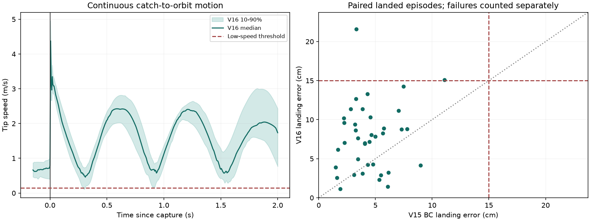

# V16 连续接抛改进记录

日期：2026-09-18至2026-09-19。V15原始环境、BC与RL checkpoint不改动。新代码、实验与输出隔离在V16目录。

## 结论边界

- 原接球后停车来自状态机，不是RL主动决策。V16已去掉强制刹停、回中与6秒等待，保留速度接入甩动。
- 连续接抛候选通过10场景开发筛选，但未通过随后固定配置的40新场景验证：BC命中39/40，连续方案36/40。当前不批准进入正式RL。
- 尚无证据证明V16 RL已经改善柔顺性。当前合格开发候选是冻结BC加改进控制器，残差为零，不是新训练出的RL。
- 全回合压力积分降低可能只是动作完成得更快，不能等同于等效刚度降低。weld载荷是仿真抓取约束力，不是实机测得的接触力。

## 原V15的问题

独立200场景：BC命中172/200，原最佳RL命中169/200；平均落点误差分别4.72、5.03 cm。167个共同命中场景中，初始50 ms峰值均值增加0.388%，初始冲量增加0.637%。详见 `V15_RL_V1_TRAINING_ANALYSIS.md`。

主要结构限制与对应改动：

| 问题 | V16处理 |
|---|---|
| 底层强制停车，RL不能控制流程 | 观测到抓取后立即接入轨道；用当前位置/速度初始化，默认0.20 s压力混合 |
| 主要撞击峰常在抓取后约1 ms，抓住后才改动作已经太晚 | 新残差在接触前调整速度匹配、压力、反馈增益与接甩混合时间 |
| 同一个任务网络受BC辅助损失和KL强约束 | 冻结BC，另建零初始化物理残差头，不再给这个头施加旧任务BC损失 |
| 初始撞击略变差也可能因少数实体接触减少被选为best | 成功数不降；峰值和冲量分别不增；明显改善另要求两项均下降至少3% |
| 物理无效动作仍影响历史观测/似然 | 固定原半径/驱动力历史值；抓取后残差全部掩码并保持最后有效值 |
| 跨回合复用可能叠乘反馈增益 | reset先恢复名义recipe，再构造控制器 |

这是一版以接球质量为主的残差RL，不开放抛球半径、驱动力或释放方位供网络优化。若以后要学最优抛球，需要另设阶段与对应指标，不能声称当前4维头覆盖了整个接抛最优控制问题。

## 释放模型诊断

直接取消停车后，旧释放模型在另一组10场景上仅6次命中，而原BC为9次。4个场景的逐时刻诊断发现：释放命令时估计球速度与仿真真实速度相差约0.39-0.44 m/s，位置相差约1.9-2.9 cm；观测时间与阀门相对调度时钟存在约5-6 ms偏差。3个失准场景中，预测落点与实际落点相差约15-20 cm。

上述命令时状态比较包含观测时刻与当时物理时刻的差，不能把全部差值当成同时间戳的传感器估计误差。预测离手状态与实际离手状态的比较另行记录。

以实际离手状态重新计算自由飞行落点，4个场景的误差约0.5-2.4 cm。这支持先修正离手前状态估计/释放调度的判断，但不单独证明每项误差的因果贡献。真实状态只用于离线诊断，未输入Actor或发布的释放控制器。

候选改为利用24个带时间戳的球位置传感器帧拟合当前状态，使用原有 `FrameFit`，并对齐阀门调度时钟。未来加速度外推在闭环中反而变差，保留为关闭的实验选项，不启用。

诊断文件：`teacher_runs/v16_continuous/rl_smoke/release_diagnostics.json`。

## 开发筛选，不是独立泛化结果

以下均复用9200001-9200010这10个开发场景，抓取均为9/10，落点均值只统计实际落地回合，漏接仍计入成功率分母。

| 配置 | 15 cm命中 | 平均落点误差cm | 判定 |
|---|---:|---:|---|
| 停车版V15 BC | 9/10 | 5.109 | 参考 |
| 直接连续接抛，旧估计 | 6/10 | 12.384 | 不合格 |
| 仅时钟对齐并取消方位偏置 | 5/10 | 14.069 | 不合格 |
| 16帧当前状态拟合 | 9/10 | 9.214 | 精度门槛不合格 |
| 24帧当前状态拟合，8 cm预测容差 | 9/10 | 7.498 | 精度门槛不合格 |
| 24帧未来运动外推 | 6/10 | 10.894 | 不合格 |
| 32帧未来运动外推 | 6/10 | 12.956 | 不合格 |
| **24帧当前状态拟合，4 cm预测容差** | **9/10** | **5.273** | **通过开发门槛，固定此候选** |
| 8秒展开轨道，旧估计 | 4/10 | 12.925 | 不合格，部分未释放 |
| 8秒展开轨道，24帧拟合 | 6/10 | 8.287 | 不合格，部分未释放 |

固定候选 `ball24_strict`：blend=0.20 s，spinup=2 s，最早释放=2.5 s，预测容差=0.04 m，球状态拟合24帧，时钟对齐开启，方位偏置0度，未来运动外推关闭，其他残差基准不变。

该候选的开发集接球到启动甩动均值10.15 ms、最大10.67 ms；抓取后0.15-2 s内最长低速时段35 ms。实际接球到释放平均11.58 s，说明“立即甩动”不等于“立即扔出”，仍需等到符合释放条件。

9个共同命中场景上，初始峰值基本不变，初始冲量增加约0.030%，压力积分下降约18%。**没有达到主要冲击改善标准**。

数据：`teacher_runs/v16_continuous/release_screen_v3/comparison.json`。此前各试验保存在 `pilot_v1`、`pilot_v2`、`release_audit_v1`、`release_audit_v2`，不覆盖失败结果。

## 固定候选的新场景验证

配置在看到新场景结果前固定，使用4300001-4300040，与此前训练/开发seed不重叠。原BC与连续候选各跑40回合，同场景配对。结果存于 `teacher_runs/v16_continuous/continuous_holdout_v1`。

| 指标 | 原V15 BC | 连续候选，零残差 |
|---|---:|---:|
| 抓取 | 39/40 | 39/40 |
| 释放 | 39/40 | 38/40 |
| 15 cm命中 | 39/40，97.5% | 36/40，90.0% |
| 实际落地回合平均落点误差 | 4.446 cm | 7.693 cm |
| 接球到启动甩动均值，39个共同抓取 | 6.0703 s | 0.01032 s |
| 初始50 ms峰值均值，39个共同抓取 | 369.624 N | 369.624 N |
| 初始50 ms冲量均值，同上 | 2.99371 N s | 2.99443 N s，+0.024% |
| 全回合压力积分均值，同上 | 267.532 psi s | 224.414 psi s，-16.12% |
| 接球到释放，38个共同释放 | 14.7477 s | 11.6652 s |

连续方案启动甩动延迟最大11.33 ms，规定观测窗口内最长低速时段35 ms；通过连续性检查。但成功数、释放数和落点误差均未通过门槛，未生成本目录的 `selected_config.json`。

新增失败是：4300001落点误差21.58 cm，4300013误差15.07 cm，4300018抓住但未释放。4300031为双方共同漏接。没有把15.07 cm四舍五入成成功，也没有把未释放回合从成功率分母剔除。

这里的两列落点均值分别来自39与38个落地回合；配对受力统计则纳入全部39个共同抓取，包含抛球失败，避免仅在成功样本上展示较低载荷。36个共同命中场景的初始冲量增幅为0.022%，结论相同：没有柔顺改善。

图左为连续方案各抓取回合对齐后的末端速度，中线为中位数、阴影为10%-90%分位；并不是原BC与V16的速度对照。抓取瞬间仍有速度突变，去掉等待不等于冲击或加速度已经平滑。图右仅画双方都有落点的回合，未释放与漏接另计入表中。

数据与复现分析：`continuous_holdout_v1/comparison.json`、`analysis.json`；分析脚本 `analysis/summarize_v16_validation.py`。这40场景在配置冻结时未使用；用于本轮失败诊断后，未来修改版本需要再分配新验证场景，不能继续称其为未见测试。

### 三个新增失败的复现诊断

对4300001、4300013、4300018复跑，只加诊断钩子，不改控制参数。抓取时间、释放时间与落点误差均复现已有记录。

| 释放预测量 | 4300001 | 4300013 |
|---|---:|---:|
| 发出命令时预测落点误差 | 3.927 cm | 3.525 cm |
| 实际落点误差 | 21.577 cm | 15.072 cm |
| 实际离手时间相对预测偏差 | +0.371 ms | +0.928 ms |
| 预测离手速度与实际离手速度之差 | 0.385 m/s | 0.259 m/s |
| 预测落点与实际落点之差 | 21.990 cm | 11.711 cm |
| 用实际离手状态预测自由飞行落点的误差 | 0.853 cm | 2.154 cm |

可见只对齐时钟仍不足够；附着运动到离手的速度预测还有显著偏差，自由飞行模型不是这两个失败案例的主要误差来源。此判断限于已诊断案例，不等于已证明所有场景的主因。

未释放的4300018：全回合未来窗口内最小预测误差为3.61 mm，但这个值不代表当下可执行的释放。仅统计最优时刻进入当前控制周期、且速度和仰角均合格的时刻，最小预测误差为5.72 cm，仍高于4 cm容差。3757次释放检查中有2017次最优时刻还在未来；门槛计数可重叠，不能相加当成独立失败次数。

因此不能把3.61 mm误解为“控制器明明可以释放却无故不放”，也不能简单放宽容差解决：另外两例已经是预测合格但实际超差。应先校准连续附着运动的短时预测及其可信范围，再重新设计释放判据。

诊断文件：`teacher_runs/v16_continuous/continuous_holdout_v1/release_diagnostics.json`；脚本 `analysis/diagnose_v16_release.py` 支持指定保存的场景文件及seed。仿真真值只记录用于诊断，没有反馈给控制器或训练Actor。

## 训练与验证状态

早期 `rl_smoke` 完成2次更新、16个训练回合，验证仅6/10命中，best保留第0次零残差，没有RL改善证据。该次运行只验证工作流与恢复训练；其源码在 `rl_smoke/source_snapshot`，checkpoint与当前源码指纹不兼容，不应直接Resume。

当前正式100次更新训练**尚未启动**。正式训练要求通过至少40场景的固定配置检查，再通过新80场景的基线门槛，随后才更新PPO。最终评估仍需200个未使用场景，同时比较原BC、连续零残差基线、RL，避免把控制器改变的收益算到RL头上。

下一步顺序：

1. 先完善连续运动下的释放预测，分别检查当前状态误差、阀门到离手延时、附着阶段速度变化与释放可达性。不能只继续收紧容差：目前已有未释放案例；也不能放宽15 cm成功标准。
2. 在开发场景上做接触前动作敏感性检查，确认残差确实改变相对抓取速度和峰值，再投入长训练。不要只靠增加BC数据或PPO更新次数。
3. 通过新场景基线门槛后训练接球残差；以初始峰值、冲量、成功率分别验收。若要声称compliance改善，还需设计固定扰动响应与等效刚度/阻尼评估，压力积分本身不足以证明。

## 实现检查

`python -m pytest tests/test_continuous_rl.py tests/test_improved_rl.py tests/test_improved_bc.py -q`：27 passed，59.52 s。包含即时接管、速度/压力衔接、动作掩码、reset、观测隔离、传感器拟合、时钟调度、PPO更新、checkpoint约束和连续性选模门槛。

V15指纹与开始前一致：teacher `f85697a51bd23440fa97902993ba90ff04193c21fe97aeb167dc7ff5d13ce03f`，RL `9881391310882b14c715e5ddee5be0a2ca08188e4aff991a5c90d11b094977b6`；BC SHA256 `19e651e5ed1b7675338b1b2b0933d6e87046fc37794fbb1fc3366b21e735dfcd`。

本轮40场景验证V16指纹：`54ebdd41f34ee96f9e7c8db9cbb40e7b7845b2602ebeac8a3b4e733d71407a7e`。

参数与启动命令见 `V16_CONTINUOUS_CATCH_THROW_GUIDE.md`。源码：`teacher_rl/continuous_env.py`、`continuous_release.py`、`continuous_model.py`、`continuous_rl.py`。入口：`START_V16_RL.ps1`。

所有结论限于当前仿真器、可达性约束及既定参数范围，不构成分布外泛化或实机安全验证。
