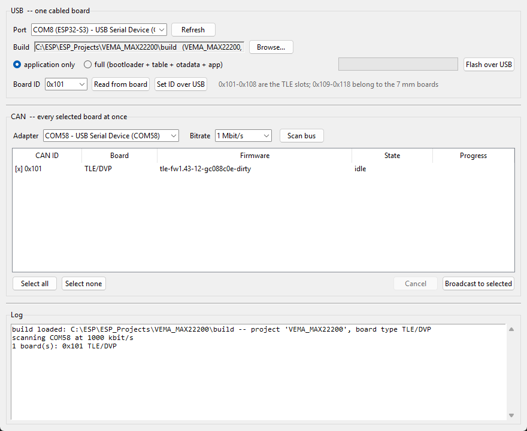
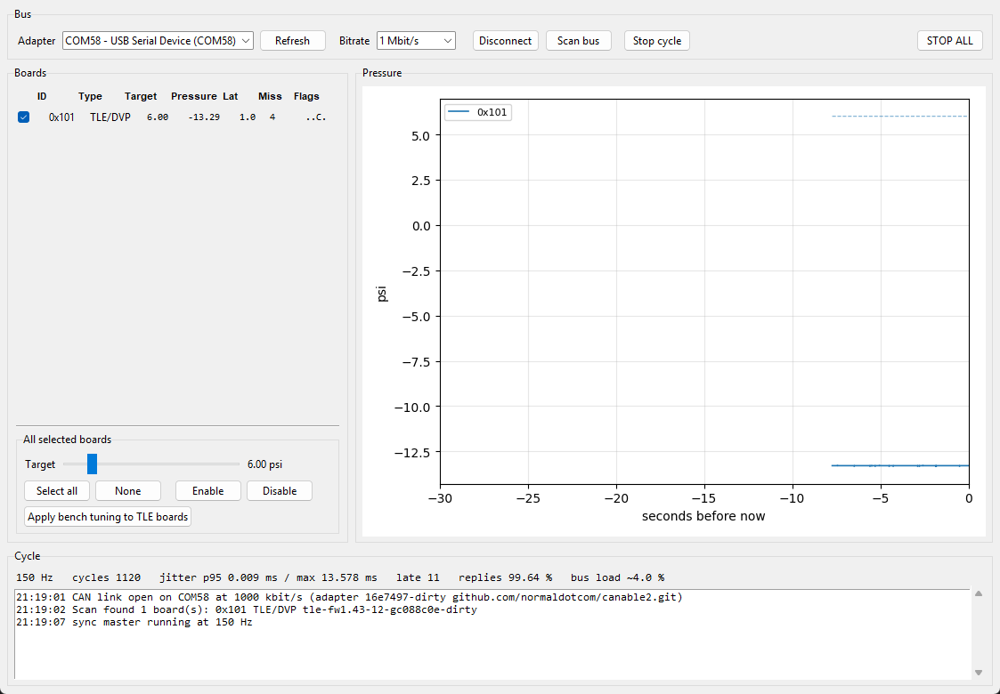

# TLE_PCB — the TLE board on the shared 24-actuator CAN bus

The robot arm runs 24 pneumatic actuators from one CAN bus at 150 Hz. Sixteen are the original
VNEMA_MK8 boards driving 7 mm on/off valves; the top eight are being replaced by TLE boards driving
Clippard DVP proportional valves. This directory is the host side of that change. The firmware side
is the repository root project (`main/`).

Read [`docs/tle_can_report.html`](docs/tle_can_report.html) first — it is four pages, mostly
diagrams, and covers the protocol, the core/task split, the control law and the update path.

## What is here

```
tlelib/            host library — nothing above backend.py touches a serial port
  proto.py         wire formats, addressing, pressure scaling, bus-load maths. No I/O.
  canlink.py       slcan adapter, receive thread, node discovery
  usblink.py       one board over its USB-Serial/JTAG port, same frames as CAN
  native.py        the TLE board's own command set (re-exported from vema_gui/vema_proto.py)
  ota.py           broadcast firmware update
  usbflash.py      esptool, driven from the build's own flasher_args.json
  backend.py       the 150 Hz sync master and the multi-board registry
  timing.py        deadline sleeping accurate enough for a 6.67 ms cycle

VEMA_TLE_flash.py       GUI: USB flashing, board-ID assignment over USB or CAN, broadcast update
VEMA_TLE_controller.py  GUI: sync master, multi-board control, a target bar per channel
tools/tle_bench.py      headless bench checks against real hardware
tools/gui_smoke.py      opens both GUIs for real, drives them, screenshots them
docs/make_figures.py    emits every report figure as SVG, from the protocol constants
```

## Addressing

| Range | Meaning |
| --- | --- |
| `0x090` | broadcast. DLC 0 is the sync edge; DLC > 0 is OTA image data |
| `0x091`–`0x098` | runtime target table, three actuators per frame |
| `0x101`–`0x108` | the eight TLE boards |
| `0x109`–`0x118` | the sixteen 7 mm boards |
| `base + 0x100` | host control: OTA start/end, set ID, diagnostics, version |
| `base + 0x200` | unicast OTA data, for repairing one board |
| `base + 0x300` | board status |
| `base + 0x400` | the TLE board's own command set — new, and ignored by old boards |

A board with no ID assigned defaults to `0x101`. Assign one before it joins the bus, or two boards
will answer to the same identifier.

Either half of the flash GUI can assign it. Over USB the cabled board is the only thing that can
answer, so the change is between two parties. Over CAN it is not, and the failure mode is exactly
the collision above — after which the two boards share a base, a control ID and a status ID, and
nothing on the bus can address one without the other. So the CAN path probes the destination for a
responder before the command goes out, refuses to move a board onto an ID that answers, and checks
both ends afterwards: the new ID has to answer and the old one has to have gone quiet. Neither path
touches the ID as a side effect of *flashing* — NVS sits below the application in the partition
layout and no image either path writes reaches it.

## Bench

Hardware for the runs recorded in the report: TLE board on **COM8** (USB-Serial/JTAG), CANable 2.0
on **COM58** (slcan, 1 Mbit/s).

Paths below are relative to the workspace root; the TLE firmware project lives at `firmware/tle/`
since the move, which is also where `usbflash.DEFAULT_BUILD` looks. See `PORTING.md`.

```
cd firmware/tle && idf.py build
cd firmware/tle && idf.py -p COM8 flash

python TLE_PCB/tools/tle_bench.py all --image firmware/tle/build/VEMA_MAX22200.bin
python TLE_PCB/VEMA_TLE_flash.py
python TLE_PCB/VEMA_TLE_controller.py
```

`tle_bench.py` runs stages independently — `usb`, `setid`, `scan`, `latch`, `sync`, `failsafe`,
`ota` — so a failure localises instead of cascading. Last full run: 28/28.

The `ota` stage updates only boards that report themselves as TLE. On anything but a single-board
bench, `scan()` returns the whole bus, and a TLE image is accepted just as readily by the sixteen
7 mm boards — which would take every one of them off the bus until it was reflashed by hand. The
flash GUI applies the same rule, comparing the image's own project descriptor against the variant
each board reported.





## Two things that will bite

**Do not batch OTA frames into one serial write.** Frames written together reach the wire back to
back, and broadcast image data all lands in one receive buffer on the board. Measured on one
896-byte block: batches of 8 delivered 1 frame; one frame per write delivered all 128, and faster.
`ota.BATCH_FRAMES` is 1 for this reason.

**Do not use a blocking serial read in the receive thread.** It waits out its whole timeout whenever
fewer bytes are available than were asked for, which batches arrivals onto the timeout's beat and
stamps them all at the end of it. That beat is uncorrelated with the control cycle, so reply latency
smears across the whole period and replies look like they missed their window when nothing was lost.
`canlink` polls `in_waiting` instead.

## Python environment

The repository `.venv` has pyserial, numpy, matplotlib and tkinter but **no esptool**; the ESP-IDF
environment has esptool but no tkinter. `usbflash.resolve_esptool_python()` finds an interpreter
that can import esptool and shells out to it, so the GUIs run from `.venv` regardless.
