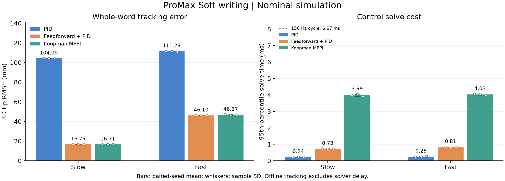
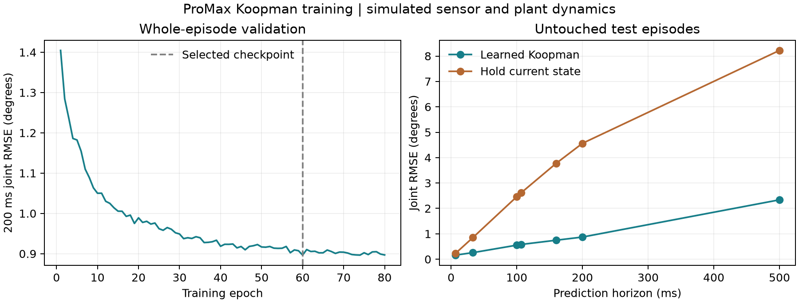
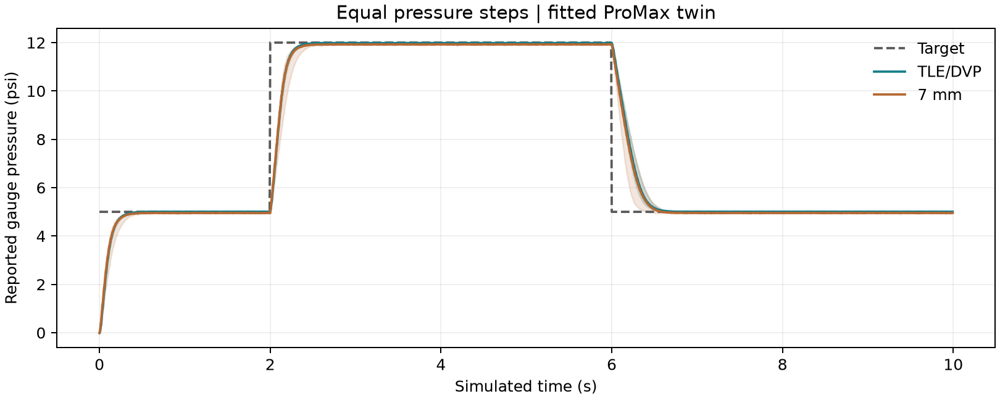

# Dynamic control of the simulated ProMax arm

This experiment implements vanilla PID, feedforward PID, and Koopman MPPI on
the fitted ProMax digital twin. The operator GUI runs control computation in a
separate process and provides joint sliders, Cartesian tip targets, and axis
nudges. The [operator guide](../../control/README.md) includes reproduction
commands. These results concern simulation; no controller was run on hardware.

The final [slow video](soft_slow_nominal_202609211.mp4) and
[fast video](soft_fast_nominal_202609211.mp4) compare all three controllers
at normal playback speed. Both use the first fresh benchmark seed, the same
reference, identical camera views, and recorded simulation poses. Their
manifests record source hashes and successful decoding of all 654 and 432
frames, respectively.

The controlled tip is the final plate centre. Scaling the original cursive
word by the measured reach ratio, 0.875459/0.692772 = 1.26370, produces a
600.8 by 288.7 mm word with a 2.8025 m stroke. Scaling speed by the same ratio
preserves the source traversal times: 189.6 and 379.1 mm/s for the slow and
fast conditions. Smooth entrance and speed ramps avoid discontinuous desired
accelerations. The largest planned angle is 10.785 degrees, and the dense
kinematic check has a maximum position residual of 0.0384 mm.

Feedback uses synchronized pressure words at 150 Hz and camera frames at
240 Hz. Camera noise is an assumed independent 0.10 degree standard deviation
per joint, with 8.33 ms latency. Simulation and GUI use the same causal 40 ms
velocity filter at camera rate. These settings test a specific sensor model;
they are not measurements of this arm's mocap noise. Offline feedback reads
filtered ADC pressure at sync instants. CAN reply delivery and operating-system
delays are assessed separately in the GUI.

Vanilla PID applies fixed gains to position error, its integral, and velocity
error, then converts the resulting differential pressure through the measured
antagonistic map. Feedforward PID adds desired-motion inverse dynamics from the
nominal fitted mechanics. Its pressure preview compensates for valve response
delay. Koopman MPPI evaluates 64 sampled differential-pressure sequences over
16 control steps, or 106.7 ms. Feedforward PID supplies the prior, and the
learned model scores pressure corrections. This implementation does not optimize
co-contraction independently. All three paths enforce the 30 psi pair limit,
including after each board's ADC rounding.

The inverse model solves the torque equation, $B(q)p=\tau$, where $B$ combines
tendon moment arms with force per unit pressure and $\tau$ includes desired
inertia, gravity, and passive forces. The allocator preserves a 6 psi pair mean
for small demands, then vents the opposing muscle and resolves the pressure
when the required difference exceeds 12 psi. This correction avoids losing
torque by clipping an infeasible negative pressure. In a retained engineering
regression, the correction reduced slow-writing tip RMS from 18.1 to 16.7 mm
for feedforward PID and from 18.2 to 16.6 mm for MPPI. These reused-seed results
are [development evidence](allocation_regression.json), separate from the fresh
benchmark below. The fast reference reaches 36.1 rad/s² at sharp curves, and
some nominal inverse-dynamics demands remain infeasible within 30 psi.

The initial small-motion PID gain selection became unstable on the full word.
That failure was retained, and a separate larger-motion stress test was added
before selecting the final gains, $K_p=85$, $K_i=8$, and $K_d=12$, in
psi/rad, psi/(rad·s), and psi·s/rad, respectively. The selected gains passed all
six nominal/perturbed confirmation cases, including nonzero initial poses and
faster boundary motions; the largest excursion was 12.38 degrees and final
settling RMS was at most 0.208 degrees. The [stress audit](../../control/checkpoints/pid_robust_tuning.json)
retains the failed gains and selection rule. Passing these cases establishes
neither stability nor small tracking error throughout the allowed workspace.

The final benchmark contains 36 trials: three fresh paired seeds, two speeds,
two plant conditions, and three controllers. Gains and model weights were
frozen beforehand. Perturbations use the same assumed ranges as training,
with new realizations; both model-based controllers retain the nominal inverse
model. The table reports mean ± sample standard deviation of the whole-writing
3D tip RMS error. Each controller sees the same plant and sensor realization
within a condition/seed. Scoring excludes entrance and final hold, and uses
simulation truth rather than the noisy feedback state.

| Plant and speed | PID (mm) | Feedforward PID (mm) | Koopman MPPI (mm) |
|---|---:|---:|---:|
| Nominal, slow | 104.09 ± 0.12 | 16.79 ± 0.14 | 16.71 ± 0.17 |
| Nominal, fast | 111.29 ± 0.36 | 46.10 ± 0.22 | 46.67 ± 0.29 |
| Perturbed, slow | 103.36 ± 1.73 | 17.88 ± 0.85 | 17.84 ± 0.67 |
| Perturbed, fast | 110.52 ± 2.37 | 47.98 ± 2.36 | 48.55 ± 2.54 |

Feedforward PID substantially improves on the stable plain-PID baseline.
MPPI is comparable to feedforward in tip error, with a small slow-condition
improvement and a small fast-condition regression. Its nominal joint RMS is
0.261 versus 0.265 degrees at slow speed and 0.715 versus 0.764 degrees at fast
speed. MPPI minimizes a joint-space cost, so a smaller aggregate joint error
need not reduce the tip error, which depends on the configuration and joint
locations. These three-seed comparisons do not establish statistical
superiority or general robustness. The [nominal aggregate](benchmark_aggregate.json)
and [perturbed aggregate](benchmark_perturbed_aggregate.json) link the result
to the source hashes; individual records include segment errors, pressure
tracking, and solve-time distributions.

Offline solve-time 95th percentiles averaged 0.24–0.25 ms for PID,
0.72–0.81 ms for feedforward PID, and 3.97–4.03 ms for MPPI across these
conditions. No measured solve exceeded 6.667 ms in 97,686 control calls; the
largest was 4.94 ms. These measurements include concurrent offline validation
on this workstation. Simulation time advances independently of solve time,
so the tracking table excludes scheduling delay. Every transmitted pressure
pair respected 30 psi (largest decoded pair sum: 29.9846 psi), and the largest tendon force was 92.64 N, below the
4000 N model clip. None of these observations establishes a hard real-time
or stability guarantee.

The real Tk GUI passed a separate SIM acceptance with a fresh plant for each
controller. A 5-degree joint-2 request produced observed final-window means
of 3.15, 5.01, and 4.97 degrees for PID, feedforward PID, and MPPI. Each test
then requested a 10 mm tip jog from its observed pose and waited nine seconds.
The following errors use averaged simulation truth; their small values for
the model-based controllers do not imply comparable hardware measurement
accuracy.

| Controller | Tip error before → after (mm) | Applied commands / bus cycles (Hz) | Solve p95 (ms) |
|---|---:|---:|---:|
| PID | 9.10 → 8.02 | 144.9 / 141.7 | 0.31 |
| Feedforward PID | 12.26 → 0.02 | 148.1 / 145.1 | 0.89 |
| Koopman MPPI | 8.15 → 0.27 | 147.9 / 144.1 | 3.70 |

PID retained substantial bias. All three tests stopped and disabled all 24
boards through window close, forced worker termination, or disconnect, with
zero serial/CAN/NatNet hardware-open attempts. Mocap ran at about 240 Hz and
97.3–98.4 percent of bus replies were received. Although active solves stayed
below 6.667 ms, the longest applied-command interval was 35.9 ms, so this GUI
does not demonstrate a hard 150 Hz loop. A cold-start failure was also fixed:
the optimizer's first import took about 240 ms. The child now discards a warmup
command while disabled, then resets from a fresh state before publishing.
The [final GUI record](../../control/results/gui_acceptance.json) separates
warmup from active timing. The [earlier startup failure](../../control/results/gui_acceptance_startup_failure.json)
and [larger warm-pose jog failure](../../control/results/gui_acceptance_mixed_postures.json)
remain available; the latter prevents interpreting this acceptance as
convergence throughout the ±25-degree slider range. The
[target-window screenshot](../../hw_tests/media/gui_dynamic_targets.png)
shows the controls and measured-error display.

The Koopman fit used 96 independent 20-second simulated episodes: 288,000
transitions over 32 simulated minutes. Twelve episodes each cover pressure
steps, chirps, multisines, common-mode pressure, ringdowns, joint references,
coupled excitation, and distal force pulses. All 12 joints were excited.
Commands reached 17.73 psi per line and 24 psi per pair; this campaign therefore
does not cover the entire allowed pressure envelope. Parameter variations
included mass and stiffness scales of 0.9–1.1, damping scales of 0.8–1.2,
force/fill/vent gains of 0.85–1.15, and added leakage of 0–150 Pa/s. These are
assumed robustness ranges, not fitted uncertainty bounds.

The model retains the 48 normalized physical state coordinates and adds 48
learned observables. Its dynamics combine a linear lifted-state update and a
rank-eight bilinear state/input term. Retaining physical state prevents a
collapsed encoder from producing a deceptively small training loss. The
bilinear term represents configuration-dependent pressure authority, but this
finite dictionary does not establish a Koopman-invariant representation or
closed-loop stability. The observed state also omits latent camera-delay and
firmware history, so it is an approximate state description rather than an
exact Markov state.

Training, validation, and test sets contain 64, 16, and 16 whole episodes.
GPU training on the RTX 5090 took 84.2 seconds for 80 epochs, with 40 batches of
512 thirty-step windows per epoch. Validation selected epoch 60 using combined
joint and pressure error. The table compares prediction of future observations
on untouched test episodes against holding the current observation constant.

| Horizon | Koopman joint RMSE | Hold-current joint RMSE | Koopman pressure RMSE | Hold-current pressure RMSE |
|---|---:|---:|---:|---:|
| 106.7 ms, deployed horizon | 0.581 deg | 2.614 deg | 2511 Pa | 8083 Pa |
| 160 ms | 0.748 deg | 3.774 deg | 3068 Pa | 11449 Pa |
| 500 ms | 2.338 deg | 8.222 deg | 5520 Pa | 22967 Pa |

At the deployed horizon, pressure errors are 2424 Pa for TLE/DVP and 2553 Pa
for the 7 mm population. The [full model report](../../control/checkpoints/canarm_koopman.json)
contains per-joint errors, source hashes, split membership, and longer horizons.
The [coverage summary](../../control/checkpoints/campaign_summary.json) records
the sampled state and pressure ranges.

The equal-input valve probe provides a separate check on the hardware-upgrade
premise. Both populations have a median simulated 10–90 percent rise time of
186.7 ms for a 5-to-12 psi common-mode step. TLE/DVP has smaller steady bias
(−0.018 versus −0.076 psi) and pressure standard deviation (0.0033 versus
0.0145 psi). Consequently, this fitted twin supports a pressure-precision
advantage but does not support a faster-flow claim for this stimulus. These
[probe results](valve_probe.json) are predictions of the fitted plant, not new
hardware measurements.

The controller uses the upgrade through 150 Hz simultaneous pressure feedback
from all 24 nodes, 240 Hz camera processing, board-specific calibration and
plant dynamics, and a pressure-state prediction model retrained at the new
sample period. These changes use the CAN architecture directly. A controlled
old-versus-new hardware experiment would still be needed to quantify a
hardware improvement; altering the fitted twin to assume faster valves would
not provide that evidence.

The warm-start trainer preserves the original normalization, can freeze the
encoder, and can penalize parameter drift from the simulation checkpoint.
The acceptance exercise verified that the validation gate retains the original
checkpoint when a short adaptation worsens prediction. This result verifies
the training path, not successful sim-to-real adaptation. Real recordings still
require conversion into causal, calibrated state/action episodes with the
checkpoint's fixed sample period. Separate real validation episodes and a
hardware controller acceptance campaign remain necessary before transfer.

The [final offline suite](validation.json) passed **1,083 tests with 7 skipped** using
`pytest digital_twin UMArm_KINEMATICS UMArm_MOCAP UMArm_KINOVA viz collection control -q --disable-warnings`.
Checks cover the existing twin and kinematics, sensor causality, pressure
rounding, inverse-model order and allocation, learned torch/numpy parity,
checkpoint/schema gates, and controller-process failure handling. The separate
[artifact audit](artifact_audit.json) recomputed all 36 benchmark RMS scores,
verified paired reference arrays and frozen source hashes, and checked both
video manifests. Raw simulation episodes and rollout NPZs remain local and
ignored; the collection, training, benchmark, and rendering commands reproduce
them from the committed code and fitted twin.
